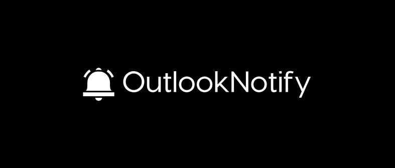
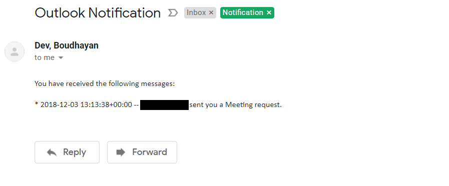
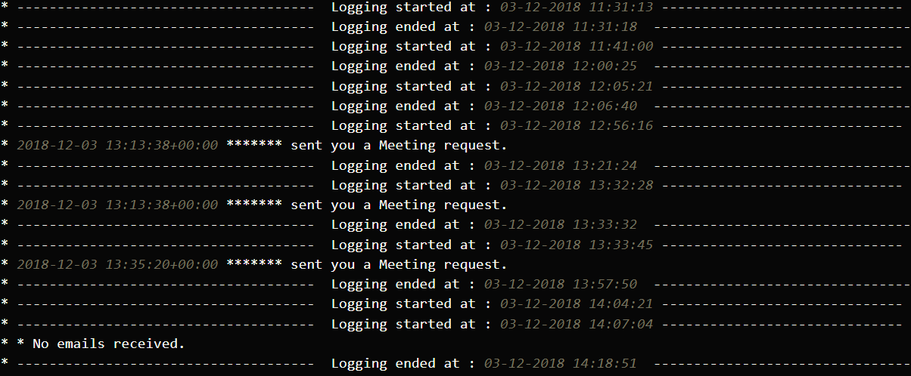

   

<h1 align="center"> 

 </h1>

 Outlook Notifications made simple ! 

Due to security reasons at my workpalce, it is not allowed to login to Outlook mail from certain devices ( mostly Android ) unless they are screened by the IT department. As a result, there have been times when I would miss important meeting requests and last-minute mails with immediate deadlines because of my absence from my device (work laptop). I had the option of forwarding e-mails to my personal mail to overcome this issue but I decided against it as it would involve the sending of confidential information to an unauthorised email.     

OutlookNotify was developed to solve this problem. It will continuously monitor my system for any new incoming mails and notify me about any last minute meeting requests. It does not forward the entire body of the received email. Instead, it just extracts the timing details of the meeting requests and forwards to my personal email. 

 

<h3> Download & Installation </h3>

<ul>
  <li>Clone the Github repository.</li>
  <code>git clone https://github.com/boudhayan-dev/OutlookNotify</code>
    
  <li>Navigate to the <code>outlook</code> directory</li>
  <code> cd OutlookNotify</code>
    
  <li>Install dependencies</li>
  <code> pip install -r requirements.txt</code>
    
  <li>Run the script.</li>
  <code>python outlook/main.py</code>
    
  <li>Alternatively, run the <code>main.bat</code> file or add it as a task in Windows Task Scheduler to trigger the script when the system in locked.</li>
</ul>

 

<h3> Demo</h3>

A sample notification received on my personal mail.
 
<table>
    <tr>
      <td>
          
      </td>
  </tr>
</table>

The following logs demonstrate the mails received during the logging period.
<table>
    <tr>
      <td>
          
      </td>
  </tr>
</table>

 

<h3>Contributing</h3>
Keep it simple. Keep it minimal.  
Also check the issues tab for some enhancement ideas.

 

<h3>License</h3>

This project is licensed under the GNU GENERAL PUBLIC LICENSE.
